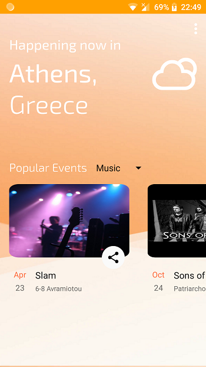
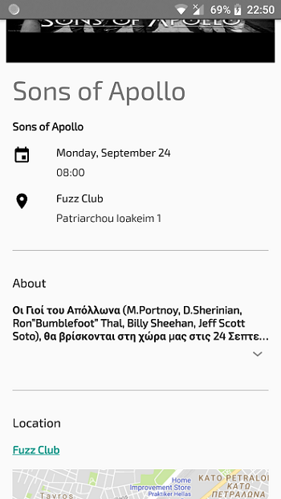
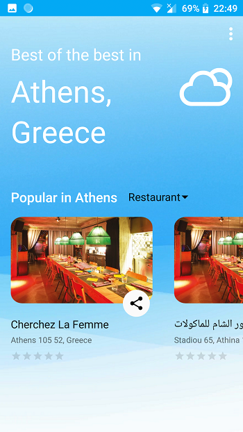
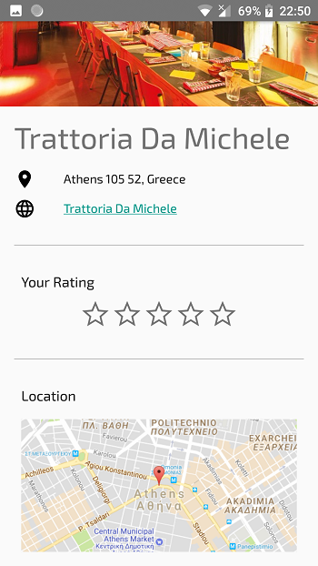

# AthLife

### The best way to get to know Athens, is by emerging in it's life.Find and attend popular events, navigate to interesting places, learn the latest about what's happening in Athens, enjoy your coffee, drink, meal in one of the best places in Athens and even more. This app helps you guide yourself through the mysterious, but beautiful, life of Athens. 

Screenshots
--
   

Tools used
--
- [Firebase Realtime Database](https://firebase.google.com/docs/database/) (to place rating for different places)
- [Firebase Authentication](https://firebase.google.com/docs/auth/) (to authenticate users)

APIs used
--
- [Eventful API](eventful.com/events)
- [Google Static Maps API](https://developers.google.com/maps/documentation/static-maps/)
- [OpenWeatherMap API](https://openweathermap.org/api)
- [Google Places API](https://developers.google.com/places/)

OpenSource Libraries used
-- 
- [FirebasUI](https://github.com/firebase/FirebaseUI-Android)
- [Retrofit](https://github.com/square/retrofit)
- [Glide](https://github.com/bumptech/glide)
- [WeatherIconView](https://github.com/pwittchen/WeatherIconView)
- [ExpandableTextView](https://github.com/Manabu-GT/ExpandableTextView)
- [MaterialRatingBar](https://github.com/DreaminginCodeZH/MaterialRatingBar)
- [LicensesDialog](http://psdev.de)
